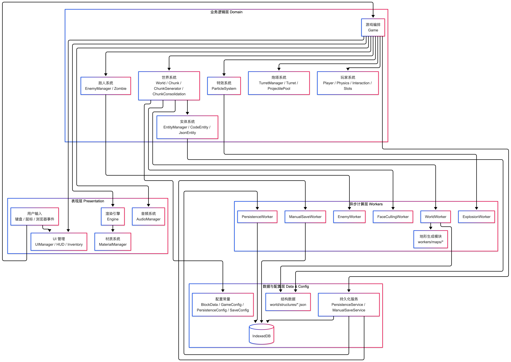

# MC-Lite

一个基于 Three.js 的我的世界轻量版（Minecraft-lite）。

项目目标是用尽量清晰的架构和可维护的代码，持续迭代一个可玩、可扩展、可实验的游戏世界。
## 在线体验

- Demo: <https://js-perf.cn>

## 本地调试

```bash
npm install
npm run start
```

启动后访问：<http://localhost:8080>

## 项目结构（简版）

```text
src/
  actors/        # 玩家、敌人、武器、炮塔
  core/          # 游戏主循环、渲染引擎、核心系统
  world/         # 区块、地形、实体、特效
  workers/       # World/Enemy/FaceCulling 等 Worker
  services/      # 持久化、手动存档、创造台
  ui/            # HUD、背包、设置面板
  constants/     # 方块定义与全局配置
  utils/         # 通用算法与工具函数
```

## 代码结构



### 游戏截图


## license

[MIT](LICENSE)
